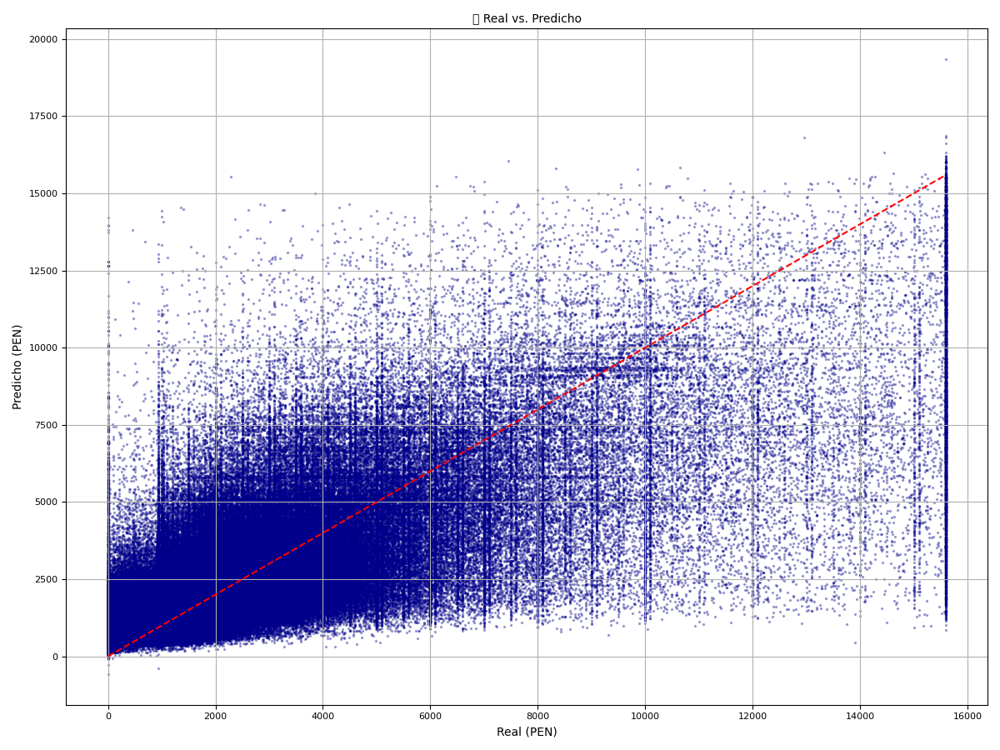
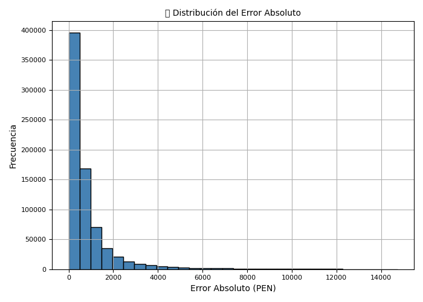
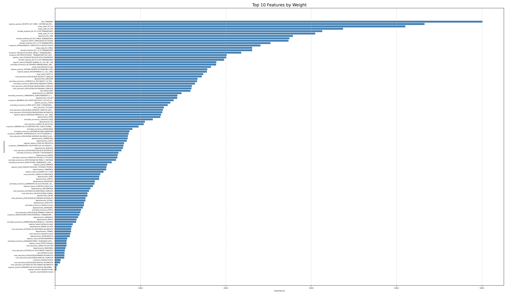
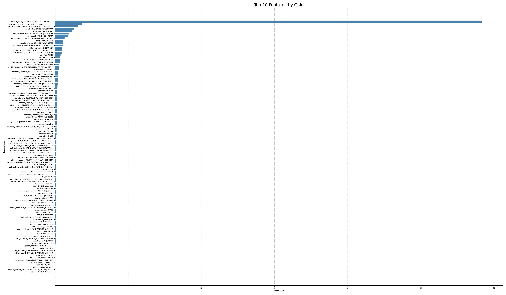
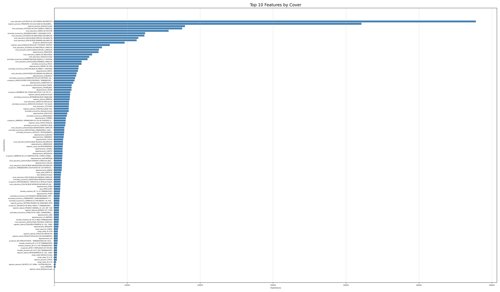
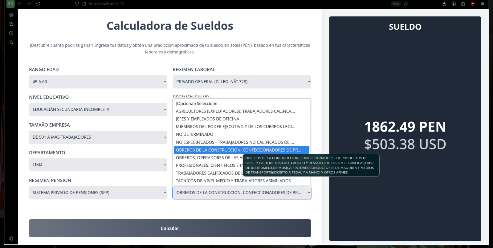
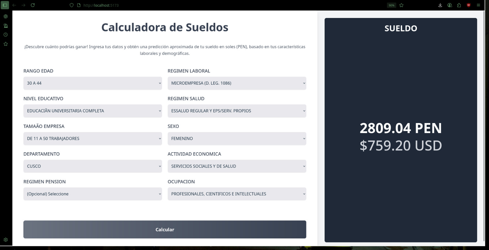
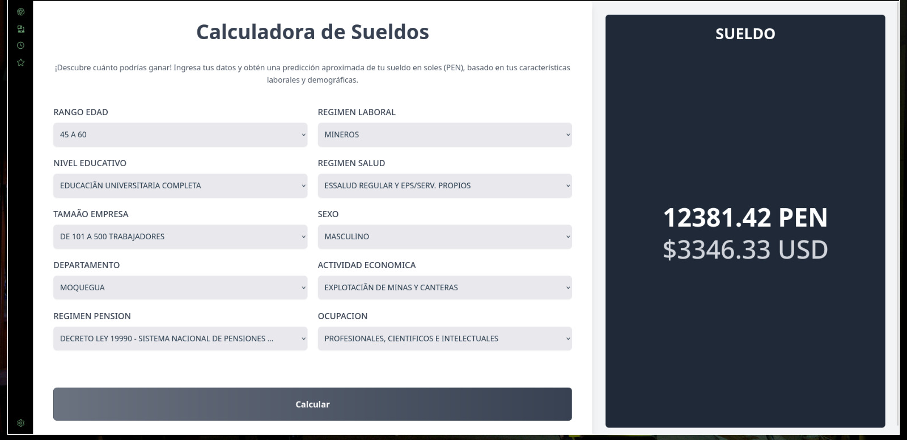
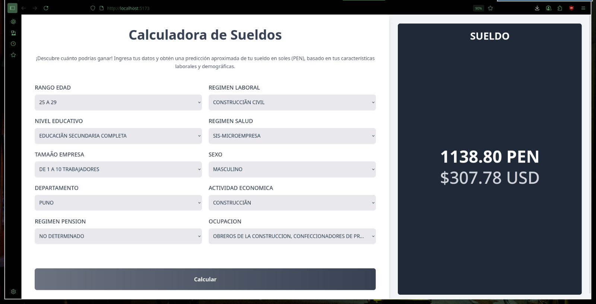

# 📊 Predicción de Sueldos MTPE - Perú

## 👨‍💻 Developed by Jorge Guillermo Olarte Quispe

## 🏫 Universidad Nacional del Altiplano – Ingeniería de Sistemas

**Predicción automatizada de remuneraciones mensuales en el sector privado peruano**  
Aplicación web basada en inteligencia artificial que estima el sueldo mensual de un trabajador en función de características demográficas y laborales. Utiliza datos abiertos del **Ministerio de Trabajo y Promoción del Empleo (MTPE)** y un modelo de machine learning (XGBoost) entrenado con datos reales.

---

## 🗂️ Estructura del Proyecto

| Módulo              | Descripción                                          | Repositorio                                                                                    |
| ------------------- | ---------------------------------------------------- | ---------------------------------------------------------------------------------------------- |
| 🖥️ Frontend         | Interfaz web en React + Tailwind para ingresar datos | [`mtpe-salary-predictor-react`](https://github.com/ArtStyle19/mtpe-salary-predictor-react)     |
| 🔁 Backend          | API REST en Flask con modelo XGBoost                 | [`backend-mtpe-salary-predictor`](https://github.com/ArtStyle19/backend-mtpe-salary-predictor) |
| 🧹 Preprocesamiento | Limpieza, codificación y entrenamiento del modelo    | Privado                                                                                        |

---

## 🎯 Objetivo del Proyecto

Diseñar un sistema que, a partir de atributos como **edad, nivel educativo, ocupación, ubicación, tamaño de empresa, entre otros**, pueda predecir el sueldo mensual de un trabajador formal privado en Perú.

---

## ⚙️ Tecnologías Utilizadas

- **Frontend:** React, TypeScript, TailwindCSS, Fetch API
- **Backend:** Python, Flask, XGBoost, Scikit-learn, Pandas, Joblib
- **Preprocesamiento:** OneHotEncoder, MinMaxScaler, Pipelines automáticos
- **Dataset:** MTPE Perú (2020-2023, datos semestrales)

---

## 🧠 Proceso de Modelado Predictivo

1. 📥 **Carga de datos:** CSV delimitado por `;` con +10 columnas relevantes.
2. 🧹 **Preprocesamiento:**
   - Imputación de valores "NO DETERMINADO"
   - Codificación One-Hot para variables categóricas
   - Normalización con MinMaxScaler
3. 🔄 **Automatización:** Pipeline con `ColumnTransformer` + persistencia con `joblib`
4. 📈 **Modelado:** Entrenamiento con XGBoost (regresión) y validación con MAE y RMSE
5. 🧪 **Evaluación:** El error promedio entre la predicción y el valor real fue de aproximadamente 844.85 soles peruanos (PEN).
6. 💾 **Despliegue:** Backend con API `/predict` y `/get-options` + frontend dinámico

---

## 📈 Evaluación del Modelo

### 🔍 Dispersión: Real vs Predicho

### 📉 Error Absoluto vs Sueldo Real

### 📊 Distribución del Error Absoluto

---

## 🧬 Importancia de Variables (XGBoost)

### 🎯 Feature Importance - Weight

### 🎯 Feature Importance - Gain

### 🎯 Feature Importance - Cover

---

## 👷‍♂️ Ejemplos de Perfiles Analizados (Visuales)

Estos perfiles visuales ayudan a contextualizar los escenarios laborales representados en el modelo:

| Imagen                                                           | Descripción                          |
| ---------------------------------------------------------------- | ------------------------------------ |
|                       | Varón obrero en Lima                 |
|                     | Mujer trabajadora en salud           |
|                       | Varón en sector minería              |
|  | Técnico en industrias manufactureras |
|             | Varón obrero en construcción         |

---

## 🧾 Licencia

Este proyecto es de uso académico y de investigación. Los datos pertenecen al MTPE y están bajo licencias de uso abierto.

---
